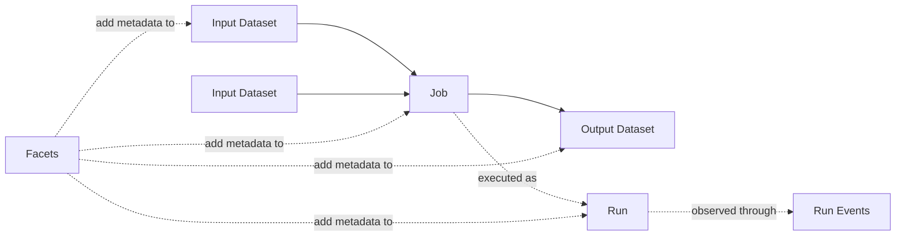

# OpenLineage Concepts

## What OpenLineage Describes

[OpenLineage](https://openlineage.io/docs/) is an open standard for reporting
how data is produced, consumed, and transformed. Integrations emit events while
work runs; a compatible backend combines those observations into a lineage
graph. The protocol describes metadata exchange. It does not prescribe a
scheduler, processing engine, or metadata backend.

The central question is: **which job execution read which datasets and produced
which datasets?**



## Core Entities

The [object model](https://openlineage.io/docs/spec/object-model) has three
entities:

| Entity | Meaning | Identity |
|---|---|---|
| **Job** | A defined unit of work, such as a scheduled task, SQL query, dbt model, or Spark action. | `namespace` + `name` |
| **Run** | One execution or occurrence of a Job. | Globally unique `runId`, normally a UUID |
| **Dataset** | A discrete collection of data read or written by a Job, such as a table, topic, object, or directory. | `namespace` + `name` |

A Job is the reusable definition; a Run is one occurrence of that definition.
Each execution should receive a new `runId`, and every event about that
execution must reuse it.

### Namespaces and names

Namespaces prevent unrelated systems from producing the same identifier. A job
namespace usually identifies its scheduler or integration; a dataset namespace
usually identifies its physical data source. For example:

- Job: namespace `airflow-prod`, name `orders.refresh_daily`
- Dataset: namespace `postgres://warehouse:5432`, name `sales.public.orders`

Names must be stable and consistent. Changing the spelling, case, host format,
or namespace convention creates a different lineage node. Follow the official
[naming conventions](https://openlineage.io/docs/spec/naming) for each data
store.

## Events

An event is a timestamped observation produced by an integration. Every event
has an `eventTime`, a `producer` URI identifying its source, and a `schemaURL`
pointing to its event schema.

OpenLineage defines three event families:

| Event | When to use it |
|---|---|
| **RunEvent** | Runtime state changes and lineage for a particular Job Run. This is the primary event for the R client. |
| **JobEvent** | Design-time or static Job metadata, without a Run—for example, declared inputs/outputs or source location. |
| **DatasetEvent** | Design-time Dataset metadata, without a Job or Run—for example, schema, ownership, or documentation updates. |

Inputs and outputs on a `RunEvent` explain the direction of lineage: inputs are
consumed by the Job; outputs are produced by it. Information can become
available gradually, so later events for the same run may add datasets or
facets not present in the first event.

## The Run Lifecycle

The same Job and Run identifiers connect all events in one execution. The
[run-cycle specification](https://openlineage.io/docs/spec/run-cycle) defines
six states:

| State | Meaning |
|---|---|
| `START` | Execution began. |
| `RUNNING` | Execution continues; often carries newly available metadata. |
| `COMPLETE` | Execution finished successfully. |
| `FAIL` | Execution failed. |
| `ABORT` | Execution stopped abnormally. |
| `OTHER` | Metadata outside the ordinary lifecycle. |

For a typical batch job, emit `START` followed by exactly one terminal state:
`COMPLETE`, `FAIL`, or `ABORT`. Events are generally accumulative: a consumer
may combine observations for the same `runId`. Streaming jobs and services can
instead emit periodic snapshots because they may have no routine terminal
event.

## Facets

A **facet** is an atomic, named piece of metadata attached to a core entity.
Facets keep the base object model small while allowing integrations to add rich
details. Adding a facet with the same key for the same entity replaces the
previous value; consumers should not merge the internal fields themselves.

Facet placement carries meaning:

| Location | Describes | Examples |
|---|---|---|
| `job.facets` | Stable properties of the work | SQL, job type, source-code location, documentation |
| `run.facets` | One execution | nominal time, parent run, error, processing engine, tags |
| `dataset.facets` | Relatively stable Dataset metadata | schema, data source, version, ownership |
| `inputFacets` | How a Dataset was read in this Run | input statistics, data-quality metrics, selected subset |
| `outputFacets` | How a Dataset was written in this Run | output row/byte/file counts, selected subset |

The distinction between `dataset.facets` and input/output facets is important.
A table schema describes the Dataset itself; the number of rows read or written
describes its participation in one Run.

### Standard and custom facets

Every facet contains:

- `_producer`: the integration or package that created the facet;
- `_schemaURL`: an immutable, versioned JSON Schema URL for the facet.

Standard facets are published with the OpenLineage specification. A custom
facet can contain additional fields but should use a project-specific key to
avoid collisions and a canonical, immutable schema URL. The official
[facet guide](https://openlineage.io/docs/spec/facets/) and
[custom-facet guide](https://openlineage.io/docs/spec/facets/custom-facets)
define the naming rules. Job and Dataset facets may use `_deleted: true` to
remove previously reported facet metadata.

## Producer and Schema Version

`producer` answers “who generated this metadata?” It should be a URI identifying
a package or source revision, not the Job owner or backend. Facet-level
`_producer` has the same purpose for that facet. See the official
[producer guidance](https://openlineage.io/docs/spec/producers).

`schemaURL` identifies the exact schema used to interpret an event. Schema and
client versions are independent: a client may change without changing the
protocol schema. Versioned schema URLs make stored events interpretable after
the specification evolves. This package initially targets
[OpenLineage 2.0.2](https://openlineage.io/spec/2-0-2/OpenLineage.json).

## Transport and Backend

The client constructs and validates events; a **transport** delivers them. The
first R release uses synchronous HTTP, normally posting to
`api/v1/lineage`. Console and no-op transports support local development and
offline examples. Authentication, retries, and TLS are transport concerns, not
parts of the OpenLineage event.

An **OpenLineage backend** receives events, validates or stores them, and builds
the graph. The client should not depend on a particular backend implementation.
Tests therefore compare JSON fixtures and mock transport responses rather than
requiring a live server.

## Minimal RunEvent Shape

This abbreviated payload shows how the concepts fit together:

```json
{
  "eventType": "START",
  "eventTime": "2026-07-19T10:00:00Z",
  "run": {"runId": "018f847a-6d5b-7f22-8c31-9a087e02b934"},
  "job": {"namespace": "scheduler-prod", "name": "orders.refresh"},
  "inputs": [
    {"namespace": "postgres://warehouse:5432", "name": "raw.public.orders"}
  ],
  "outputs": [
    {"namespace": "postgres://warehouse:5432", "name": "sales.public.orders"}
  ],
  "producer": "https://example.org/openlineage-r/0.1.0",
  "schemaURL": "https://openlineage.io/spec/2-0-2/OpenLineage.json#/$defs/RunEvent"
}
```

The corresponding terminal event reuses the Job identity and `runId`, changes
`eventType` and `eventTime`, and adds any metadata learned during execution.

## Mapping to This R Package

Version 0.1.0 will expose S7 models for events and protocol values, an R6
`OpenLineageClient`, deterministic `jsonlite` serialization, and an `httr2`
HTTP transport. Typed facets cover common cases; `ol_facet()` allows valid
standard or custom facets that do not yet have a dedicated R class. See
[`roadmap.md`](roadmap.md) for release scope and [`python.md`](python.md) for
the Python reference-client inventory.

## Practical Rules

1. Keep Job and Dataset identifiers stable across runs and integrations.
2. Generate one `runId` per execution and reuse it through the lifecycle.
3. Emit one terminal event for each finite batch Run.
4. Attach metadata to the entity or input/output occurrence it describes.
5. Use immutable schema URLs and identify the real metadata producer.
6. Never put transport credentials inside event or facet data.
