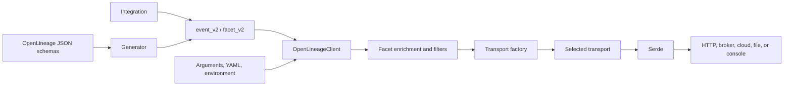

# OpenLineage Python Client Source Guide

## Scope

This guide describes `client/python/src/` from the OpenLineage Python client
version 1.52.0. Paths are relative to `client/python/`. The Python client is a
behavioral reference for the R package, not an API template: preserve protocol
semantics while using idiomatic R models, conditions, and configuration.

## Architecture

`OpenLineageClient.emit()` validates the event class, adds configured
environment, tag, and source-code-location facets, applies job-name filters,
and delegates to a transport. Configuration is merged from constructor data,
YAML, and `OPENLINEAGE__...` variables. The transport factory creates built-in
or dynamically imported transports. Most transports call `Serde` immediately
before delivery; this removes nulls, unwraps enums, and produces sorted JSON.

## Core Modules

| File | Role and key symbols |
|---|---|
| `src/openlineage/client/__init__.py` | Public package surface: exports `OpenLineageClient`, options, version, and synchronizes the v1/v2 producer setting. |
| `src/openlineage/client/client.py` | Main coordinator. `OpenLineageClient` loads configuration, resolves transports, enriches/filters events, emits them, and closes delivery resources. |
| `src/openlineage/client/constants.py` | Client version and default timeout, namespace, URL, and producer constants. |
| `src/openlineage/client/event_v2.py` | Stable v2 event facade over generated base models; aliases generated `EventType` as `RunState`. |
| `src/openlineage/client/facet.py` | Deprecated, hand-written v1 facet classes retained for compatibility. |
| `src/openlineage/client/facet_v2.py` | Public v2 facet facade; exposes generated facet modules and base facet types. |
| `src/openlineage/client/facets.py` | Configuration models controlling environment-variable and source-code-location facet enrichment. |
| `src/openlineage/client/filter.py` | Exact and regular-expression job-name filters plus their configuration factory. Matching events are suppressed. |
| `src/openlineage/client/git.py` | Reads repository URL, commit, branch, tag, and CI pull-request metadata without invoking Git, for source location facets. |
| `src/openlineage/client/py.typed` | PEP 561 marker declaring that the installed package ships usable type information. |
| `src/openlineage/client/run.py` | Deprecated v1 `RunEvent`, `Run`, `Job`, `Dataset`, and `RunState` models and basic UUID/time validation. |
| `src/openlineage/client/serde.py` | Converts attrs models to dictionaries/JSON, recursively removes null or empty values, and unwraps enums. |
| `src/openlineage/client/tags.py` | Job- and run-tag configuration model. |
| `src/openlineage/client/utils.py` | Dynamic imports, attrs-field filtering, recursive dictionary merging, and the redaction metadata mixin. |
| `src/openlineage/client/uuid.py` | Generates random or deterministic time-ordered UUIDv7-compatible run identifiers. |

## Transport Modules

| File | Role and key symbols |
|---|---|
| `src/openlineage/client/transport/__init__.py` | Registers built-in transport kinds in the singleton factory and exposes registration/public transport APIs. |
| `src/openlineage/client/transport/transport.py` | Defines the `Config`, `Transport`, and `TransportFactory` contracts, including `emit()` and `close()`. |
| `src/openlineage/client/transport/factory.py` | `DefaultTransportFactory` validates config, dynamically resolves classes, constructs transport-specific config, and assigns names/priorities. |
| `src/openlineage/client/transport/http_common.py` | Shared retry defaults for synchronous and asynchronous HTTP delivery. |
| `src/openlineage/client/transport/http.py` | Synchronous `requests` transport with URL/TLS settings, retries, custom headers, gzip, API-key/JWT authentication, and token caching. |
| `src/openlineage/client/transport/async_http.py` | Background-thread/httpx transport with a bounded queue, concurrency limits, retries, statistics, graceful close, and START-before-terminal ordering. |
| `src/openlineage/client/transport/composite.py` | Sends through multiple child transports with priority sorting and configurable stop/continue behavior on success or failure. |
| `src/openlineage/client/transport/console.py` | Serializes events to the application log; also serves as the unconfigured fallback. |
| `src/openlineage/client/transport/noop.py` | Intentionally discards events when OpenLineage is disabled. |
| `src/openlineage/client/transport/file.py` | Writes JSON to local files or optional `fsspec` backends, with append, timestamped, and human-readable debug modes. |
| `src/openlineage/client/transport/kafka.py` | Publishes serialized events with `confluent-kafka`, including producer configuration, callbacks, flushing, and Airflow safeguards. |
| `src/openlineage/client/transport/msk_iam.py` | Extends Kafka delivery with AWS MSK IAM region detection and OAuth token generation. |
| `src/openlineage/client/transport/amazon_datazone.py` | Sends run events to an Amazon DataZone domain through an optional boto3 client. |
| `src/openlineage/client/transport/gcplineage.py` | Sends run events to Google Cloud Data Catalog Lineage, selecting synchronous or asynchronous clients by configured rules. |
| `src/openlineage/client/transport/datadog.py` | Maps Datadog sites to intake endpoints and routes events through configured synchronous/asynchronous HTTP transports. |
| `src/openlineage/client/transport/transform/__init__.py` | Public exports for transforming transports and the built-in namespace transformer. |
| `src/openlineage/client/transport/transform/transform.py` | Wraps another transport, deep-copies events, dynamically loads an `EventTransformer`, and emits or drops its result. |
| `src/openlineage/client/transport/transform/transformers/__init__.py` | Package marker for built-in transformer implementations. |
| `src/openlineage/client/transport/transform/transformers/job_namespace_replace_transformer.py` | Replaces job namespaces, optionally including parent/root job references in a parent-run facet. |

## Generated Event and Facet Models

Files in `generated/` are produced from OpenLineage JSON schemas. They carry
schema URLs, attrs models, field documentation, selected validators, and
redaction metadata; edit the schema or generator rather than these files.

| File | Role |
|---|---|
| `src/openlineage/client/generated/__init__.py` | Package marker for generated modules. |
| `src/openlineage/client/generated/base.py` | Protocol foundation: base events/facets, event types, run/job/dataset objects, static metadata events, and producer/schema handling. |
| `src/openlineage/client/generated/base_subset_dataset.py` | Input/output subset facets and boolean, comparison, location, literal, and partition condition models. |
| `src/openlineage/client/generated/catalog_dataset.py` | Dataset catalog framework, type, name, URI, warehouse, source, and properties metadata. |
| `src/openlineage/client/generated/column_lineage_dataset.py` | Dataset- and field-level input lineage with transformation metadata. |
| `src/openlineage/client/generated/data_quality_assertions_dataset.py` | Detailed dataset assertions, outcomes, severity, expected/actual values, and query content. |
| `src/openlineage/client/generated/data_quality_metrics_dataset.py` | General dataset row/file/byte counts and per-column quality metrics. |
| `src/openlineage/client/generated/data_quality_metrics_input_dataset.py` | Input-dataset-specific form of data-quality metrics. |
| `src/openlineage/client/generated/dataset_type_dataset.py` | Dataset type and subtype classification. |
| `src/openlineage/client/generated/dataset_version_dataset.py` | Dataset version identifier. |
| `src/openlineage/client/generated/datasource_dataset.py` | Logical data-source name and URI. |
| `src/openlineage/client/generated/documentation_dataset.py` | Dataset documentation text and content type. |
| `src/openlineage/client/generated/documentation_job.py` | Job documentation text and content type. |
| `src/openlineage/client/generated/environment_variables_run.py` | Selected environment-variable names and values attached to a run. |
| `src/openlineage/client/generated/error_message_run.py` | Run error message, language, and optional stack trace. |
| `src/openlineage/client/generated/execution_parameters_run.py` | Named execution parameters and their descriptions/values. |
| `src/openlineage/client/generated/external_query_run.py` | External query identifier and source system. |
| `src/openlineage/client/generated/extraction_error_run.py` | Metadata-extraction task totals and structured extraction errors. |
| `src/openlineage/client/generated/hierarchy_dataset.py` | Ordered dataset hierarchy levels such as database, schema, and table. |
| `src/openlineage/client/generated/input_statistics_input_dataset.py` | Input row, size, and file counts. |
| `src/openlineage/client/generated/job_dependencies_run.py` | Upstream/downstream job and run dependencies with trigger semantics. |
| `src/openlineage/client/generated/job_type_job.py` | Processing/integration/job type and event-emission pattern. |
| `src/openlineage/client/generated/lifecycle_state_change_dataset.py` | Dataset lifecycle operation and optional previous identifier. |
| `src/openlineage/client/generated/nominal_time_run.py` | Nominal run start and optional end time. |
| `src/openlineage/client/generated/output_statistics_output_dataset.py` | Output row, size, and file counts. |
| `src/openlineage/client/generated/ownership_dataset.py` | Dataset owners and ownership types. |
| `src/openlineage/client/generated/ownership_job.py` | Job owners and ownership types. |
| `src/openlineage/client/generated/parent_run.py` | Parent and optional root run/job relationships. |
| `src/openlineage/client/generated/processing_engine_run.py` | Processing engine name/version and adapter version. |
| `src/openlineage/client/generated/schema_dataset.py` | Nested dataset field schema, types, descriptions, and ordinal positions. |
| `src/openlineage/client/generated/source_code_job.py` | Job source code and language. |
| `src/openlineage/client/generated/source_code_location_job.py` | Source repository URL, path, revision, branch, tag, and pull request. |
| `src/openlineage/client/generated/sql_job.py` | SQL query text and optional dialect. |
| `src/openlineage/client/generated/storage_dataset.py` | Storage layer and file format. |
| `src/openlineage/client/generated/symlinks_dataset.py` | Alternate dataset identifiers. |
| `src/openlineage/client/generated/tags_dataset.py` | Dataset/field key-value tags and their source. |
| `src/openlineage/client/generated/tags_job.py` | Job key-value tags and their source. |
| `src/openlineage/client/generated/tags_run.py` | Run key-value tags and their source. |
| `src/openlineage/client/generated/test_run.py` | Test executions attached to a run, including status, severity, evidence, and parameters. |

## Schema Generator

| File | Role and key symbols |
|---|---|
| `src/openlineage/client/generator/__init__.py` | Generator package marker. |
| `src/openlineage/client/generator/base.py` | Shared JSON Schema parsing, schema metadata collection, custom attrs-model configuration, import cleanup, Ruff formatting, and output writing. |
| `src/openlineage/client/generator/generate.py` | Repository maintenance command that reads official base/facet schemas and redaction rules, rebuilds `generated/`, and regenerates `facet_v2.py`. |
| `src/openlineage/client/generator/cli.py` | Installed `ol-generate-code` command for previewing models generated from external facet specifications against the published base schema. |
| `src/openlineage/client/generator/header.py` | Copyright/SPDX header copied into generated Python files. |
| `src/openlineage/client/generator/templates/Enum.jinja2` | Renders schema enums with formatted descriptions. |
| `src/openlineage/client/generator/templates/dataclass.jinja2` | Main attrs-class template; handles fields, defaults, schema URLs, producer data, redaction lists, extra properties, and validators. |
| `src/openlineage/client/generator/templates/facet_v2.jinja2` | Builds the public `facet_v2.py` import/export facade. |
| `src/openlineage/client/generator/templates/root.jinja2` | Renders schema root aliases and union types. |
| `src/openlineage/client/generator/templates/validators.jinja2` | Generates date-time, URI, and UUID field validators. |

## Dataset Naming

| File | Role and key symbols |
|---|---|
| `src/openlineage/client/naming/__init__.py` | Naming package marker. |
| `src/openlineage/client/naming/dataset.py` | `DatasetNaming` protocol and canonical namespace/name builders for databases, warehouses, filesystems, Kafka, and Pub/Sub. |

## Implications for the R Client

The essential porting boundary is smaller than the source tree suggests. The R
client needs schema-aligned S7 event/facet models, deterministic JSON
serialization, an R6 client that applies enrichment and filtering, a transport
contract, and an `httr2` HTTP implementation. Cloud/broker transports,
transformers, source-control enrichment, and schema generation can be added
independently after the core event-to-HTTP path is compatible and tested.
